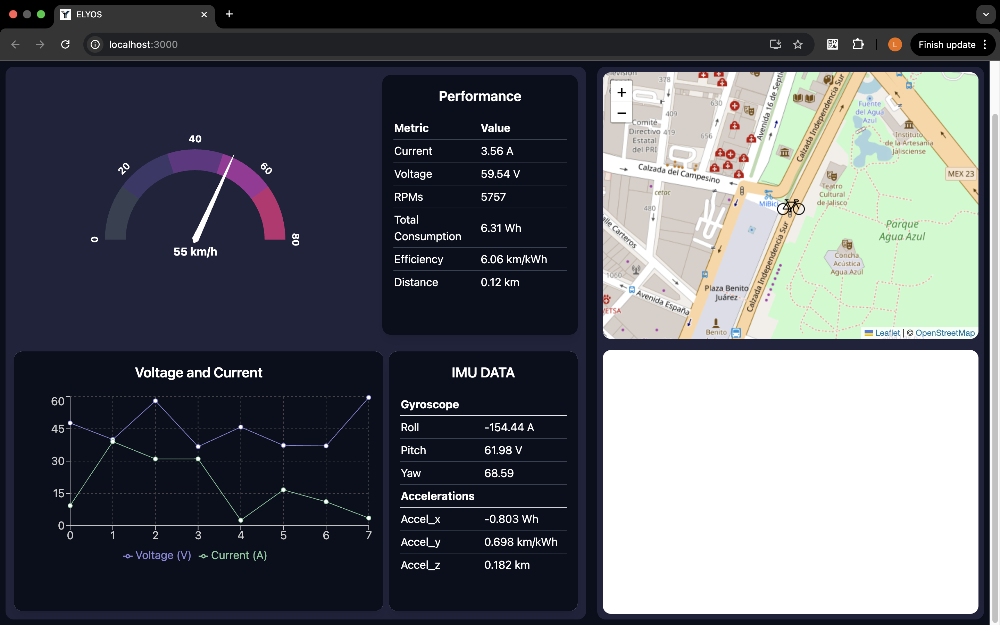

# 🛰️ ELYOS Telemetry System

Real-time telemetry system developed by the **ELYOS Racing Team** at Tecnológico de Monterrey, Campus Guadalajara, for our electric prototype competing in the **Shell Eco-marathon**.

## 🚗 Purpose

This project aims to:

- Monitor key parameters of the electric vehicle in real-time.
- Visualize critical data such as speed, voltage, current, temperature, GPS location, RPMs, and more.
- Assist engineers and drivers in making data-driven decisions during testing and competition.

## ⚙️ Technologies

- **Frontend:** React + TailwindCSS
- **Backend:** Express.js + Node.js
- **Database:** PostgreSQL
- **Additional Tools:** WebSocket, REST API

## 📡 Tracked Telemetry Variables

- Distance traveled  
- Voltage and current  
- GPS coordinates  
- Acceleration and orientation  
- RPMs  
- Vehicle and driver speed  
- Ambient and motor temperature  
- Steering direction  
- Attempt timer  

## 📊 Data Visualization

The system includes a dashboard with:

- **Real-time speed and RPM graphs**  
- **Battery level and energy consumption indicators**  
- **Temperature monitoring (motor and ambient)**  
- **Live GPS map** for vehicle tracking  
- **Performance comparison between runs**  
- **Driver feedback panel** to evaluate driving efficiency  

## 🏁 Context

This telemetry system is part of the ongoing innovation by the **ELYOS Racing Team**, a multidisciplinary student group focused on energy efficiency and electric mobility.

It directly supports our participation in the **Shell Eco-marathon**, a global engineering competition where teams design and race ultra-efficient vehicles. The system plays a vital role in **testing, validation, and race strategy**, allowing us to improve performance through real-time data acquisition and analysis.

Learn more about ELYOS: [elyosracingteam.com](https://elyosracingteam.com)

## 📄 License

This is an academic and non-commercial project developed within Tecnológico de Monterrey.  
Released under the [MIT License](https://opensource.org/licenses/MIT).

## 🖼️ Screenshots

### 📈 Dashboard

---

